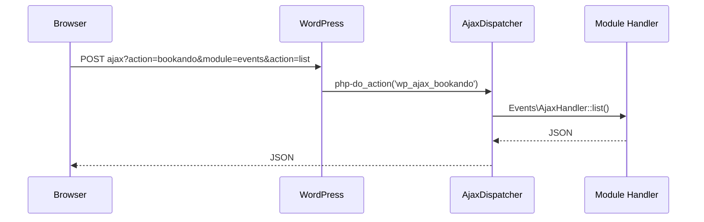

# 📦 Bookando – Plugin‑ & SaaS‑Struktur   (Technische Dokumentation v 2.2)

> **Änderungsstand 2025-05-16**  
> Konsolidierte Fassung aus v 2.0 (Alt) und v 2.1 (Neu)  
> *Alle doppelten Abschnitte wurden zusammengeführt, widersprüchliche Punkte bereinigt (s. Changelog).*

----

## 🔧 Zielsetzung

Bookando ist ein **zukunftssicheres, modular erweiterbares** WordPress‑ & SaaS‑Framework für **Events, Kurse, Buchungen, Ressourcen‑ & Kundenverwaltung, Zahlungen, Lerninhalte und Kommunikation**.  
Einsatzgebiete: Salons, Studios, Agenturen, Coaches – **sowie Fahrschulen** dank des *Education‑Packs* (OrphyDrive‑Features).

Kernprinzipien:

* **Modularität & Lizenz‑Flagging** – Funktionen werden per Modul aktiviert, SaaS‑Plan bestimmt Zugriffsrechte.  
* **Vue 3 + Vite + TypeScript SPA** im Admin und in Portalen.  
* **REST / GraphQL API** + Webhook‑Dispatcher.  
* **Offline‑fähig** (PWA, IndexedDB‑Sync) für Fahrlehrer‑ & Schüler‑Apps.  
* **Mandantenfähig** – Betrieb als klassisches Plugin *oder* Multi‑Tenant‑SaaS.  
* **DSGVO‑konform**, Mehrsprachigkeit (DE/EN/FR/IT), White‑Label‑Option.

----

## 🧱 Architekturübersicht

```text
bookando/
├── bookando.php                # Haupt-Plugin-Datei, Entry-Point für WP (lädt Core\Plugin)
├── composer.json               # Composer-Konfig für PHP-Abhängigkeiten & Autoloading (PSR-4)
├── package.json                # JS/TS-Abhängigkeiten (Vite, Vue, etc.)
├── package-lock.json           # Genaue Lock-Datei für JS-Dependencies
├── vite.config.js              # Standard-Build-Konfiguration (Core & alle Module, empfohlen)
├── vite.config.core.js         # (optional) Nur für getrennte Core-Builds (z. B. White-Label)
├── vite.config.module.js       # (optional) Nur für getrennte Modul-Builds (Spezialfälle)
├── .eslintrc.json              # Linter-Konfiguration für JS/TS-Codequalität
├── vitest.config.js            # Testing-Konfiguration für JS/TS
├── .gitignore                  # Git-Ausnahmen (node_modules, dist, etc.)
├── readme.txt                  # WordPress-kompatible Pluginbeschreibung (für WP-Repo)
├── docs/
│   ├── Bookando-Plugin-Struktur.md # Technische Architektur, Doku, verbindlich!
│   ├── Licensing.md                # Lizenzmodell, API, SaaS-Handling
│   └── Guidelines.md               # Coding-Standards für Vue, CSS, Naming
├── languages/
│   └── bookando.pot                # Übersetzungs-Template (i18n, gettext)
├── scripts/
│   ├── generate-module.js          # CLI: Erstellt neue Modulstruktur (Scaffolding)
│   ├── cleanup.js                  # Build-Utility, räumt veraltete Artefakte auf
│   ├── check-license.js            # CLI/Build-Check für Lizenzstatus
│   ├── doctor.php                  # CLI: Diagnose-/Systemcheck
│   ├── export-license-map.php      # Exportiert Lizenz-/Featuremapping (z. B. für SaaS)
│   ├── query-license.php           # CLI: Fragt Lizenz-Status ab
│   └── … (weitere Build/Dev-Utilities nach Bedarf)
├── vendor/                        # Composer-Autoload, PHP-Abhängigkeiten
├── dist/                          # Build-Output von Vite (immer git-ignored)
│   ├── core/                      # Core-Assets (CSS/JS)
│   └── modules/<slug>/            # Build-Output pro Modul (JS/CSS Bundles)
└── src/
    ├── Core/                      # Zentrale Plugin-Logik, immer groß geschrieben
    │   ├── Plugin.php             # Einstiegspunkt des Plugins (init, Hooks, Loader etc.)
    │   ├── Loader.php             # Lädt Module, Dispatcher, Rollen
    │   ├── Installer.php          # Setup/Upgrade-Logik für das Plugin (DB, Defaults)
    │   ├── Dispatcher/            # Zentrale Request-Handler (REST, AJAX, Webhook)
    │   │   ├── AjaxDispatcher.php     # AJAX-Handler (immer mit Nonce + Capabilities)
    │   │   ├── RestDispatcher.php     # REST-API-Handler (Permission Callback!)
    │   │   └── WebhookDispatcher.php # Webhook-Endpoint, Token+Signature geprüft
    │   ├── Licensing/
    │   │   ├── LicenseManager.php    # Prüft Lizenz, Module/Feature-Flags
    │   │   └── license-features.php  # Zentrales Mapping Plan <-> Module/Features
    │   ├── Manager/
    │   │   ├── ModuleManager.php     # Lädt/aktiviert Module nach Lizenz & Slug
    │   │   └── ModuleManifest.php    # Kapselt/parst module.json (Meta, Flags)
    │   ├── Admin/
    │   │   ├── Menu.php              # Registriert/steuert Admin-Menüs (WP-Backend)
    │   │   └── Settings.php          # Zentrale Settings (Optionen, global)
    │   ├── Design/
    │   │   ├── Templates/            # PHP-Templates für UI, Fallback/Server-Rendering
    │   │   └── assets/               # Gemeinsame Design-Assets (SCSS, Icons, Images, JS)
    │   │       ├── scss/             # Zentrales SCSS-Designsystem (alle UI-Komponenten)
    │   │       ├── icons/            # Zentrale SVG/Font-Icons
    │   │       ├── images/           # Grafiken fürs Backend (z. B. Logos)
    │   │       ├── js/interop.js     # (optional) Bridge für jQuery oder 3rd-Party
    │   │       └── vendor/           # Vendor-Libs (z. B. flatpickr, intlTel)
    │   ├── Helper/                   # Utility-Klassen, klein & spezialisiert
    │   │   ├── Icons.php             # Icons-Logik/Mapping
    │   │   ├── Locales.php           # Sprach- & Länder-Utilities
    │   │   └── … weitere kleine Helpers
    │   ├── Roles/
    │   │   └── CapabilityService.php # Zentrale Rollen-/Rechtestruktur
    │   ├── Base/
    │   │   ├── BaseModel.php         # Abstrakte Basisklassen für DB-Modelle
    │   │   ├── BaseAdmin.php         # Abstrakte Basisklassen für Admin-Panels
    │   │   └── … weitere abstrakte Klassen/Traits
    │   ├── Holes/                    # (optional, Erweiterungspunkte/"Plug-in Points")
    └── modules/                      # Alle Module, immer klein geschrieben!
        └── <slug>/                   # Jedes Modul (Slug = Verzeichnisname, z. B. "customers")
            ├── Module.php            # Einstiegspunkt des Moduls (extends BaseModule)
            ├── module.json           # Manifest: Name, Lizenz, Features, Meta, Abhängigkeiten
            ├── Installer.php         # Modul-interne Setup-/Migrationslogik
            ├── Model.php             # Modell-Klasse für die Modul-Logik/DB
            ├── Admin/                # SPA-Mountpoint für Admin, ggf. eigene Sub-Assets
            │   └── index.php         # (oder vue-mountpoint, Einstieg für Backend-UI)
            ├── Api/                  # REST-API-Endpoints (nur für dieses Modul)
            │   └── <endpoint>.php
            ├── Templates/            # PHP-Templates für Fallback/SSR/Email
            │   ├── list.php          # Listenansicht (z.b. Kundenliste)
            │   ├── form.php          # Formular (z.b. Kunde bearbeiten/anlegen)
            │   ├── _filterbar.php    # (optional: Partial für Filterbar)
            │   ├── _table.php        # (optional: Partial für Tabelle)
            │   └── .....
            ├── Assets/
            │   └── vue/              # Vue 3 SPA pro Modul
            │   │   ├── main.js
            │   │   ├── components/
            │   │   ├── views/
            │   │   └── dist/         # (optional) Modul-Build-Output (nur wenn Modul separat gebaut)
            │   └── css/              
            │   │   └── admin.css
            │   └── js/              
            │       └── admin.js
            ├── Views/                # (optional) SSR-/PHP-Views, Best Practice!
            ├── Tests/                # (optional) PHPUnit/Integrationstests, Best Practice!
            ├── README.md             # (optional) Doku/Beschreibung pro Modul

```

### Build‑Setup

* **Standard‑Pfad:** *eine* `vite.config.js` – steuert Core **und** Module; Modul‑Slug via `env.MODULE` <br>→ Einfachste CI/CD‑Pipeline.  
* **Erweiterter Pfad (mehrere Pipelines):** Aktiviere **`vite.config.core.js`** + **`vite.config.module.js`** für getrennte Bundles, wenn z. B. Core und einzelne Module unabhängig deployed werden müssen.  
* *Empfehlung:* Starte mit der Single‑Config. Spätere Auslagerung ist rückwärts­kompatibel.

----

### Bookando – Globale Helper-Funktionen

- Alle globalen Utilitys werden in `/src/Core/Helpers.php` als `bookando_*`-Funktionen (ohne Namespace) bereitgestellt.
- Diese Funktionen wrappen Methoden aus Service-Klassen wie `Bookando\Core\Helper\Icon`, `Languages`, `Locales` usw.
- **Verwendung:** Immer als globale Funktion im gesamten Plugin/Theme/Template-Bereich. Nie via Namespace oder Import!
- **Ziel:** Maximale Kompatibilität zu WordPress-Standards, Themes, Child-Themes, Multisite.
- **Helpers.php** wird im Loader immer geladen.

**Beispiel:**
```php
bookando_get_template('module', 'template');
echo bookando_icon('user', 'icon-large');
```

----


## 🔀 Modulgruppen

| Gruppe | Zweck |
|--------|-------|
| `core` | Dashboard, Kalender, Buchungen |
| `offers` | Dienstleistungen, Kurse, Events, Onlinekurse |
| `crm` | Kunden, Kommunikation, Benachrichtigungen, Custom‑Fields |
| `resources` | Mitarbeiter, Orte, Fahrzeuge, Räume |
| `finance` | Rechnungen, Zahlungen, Gutscheine, Abos |
| `education` | Ausbildungskarte, Fortschritt, Lernmaterial, Tests |
| `integration` | API‑Keys, Kalender‑Sync, Tracking, Social‑Login |
| `system` | Einstellungen, Design, Exporte, Zeit‑Tracking |
| `ux` | Frontend‑Widgets, Formular‑UX |

> Lizenzpläne steuern den Zugriff (z. B. Plan *education* schaltet alle `education`‑Module frei).

----

## 🗂️ Modul-Feature-Mapping & Lizenzierung

Bookando trennt **strikt** zwischen:

- **Feature-Definition**: Jedes Modul beschreibt in seiner `module.json` (im Modul-Ordner) ausschließlich, welche Funktionen (Features) es bietet und ob es von anderen Features/Modulen abhängig ist (`features_required`, `dependencies`).  
- **Lizenz-Zuordnung**: Welche Lizenz (z. B. Starter, Pro, Enterprise) welche Module und Features freischaltet, wird **zentral** in `src/core/licensing/license-features.php` gepflegt.

**Beispiel für `module.json` eines Moduls:**

```json
{
  "slug": "gutscheine",
  "name": { "default": "Gutscheine", "en": "Vouchers" },
  "description": { "default": "Verwaltung von Gutscheinen" },
  "features": ["import_export", "batch_create"],
  "dependencies": [],
  "features_required": [],
  "tabs": ["Allgemein", "Import/Export"],
  "version": "1.0.0",
  "doc": "Siehe docs/gutscheine.md für die vollständige technische und fachliche Beschreibung."
}
```

### 📌 Modulversionierung und Dokumentation

Jedes Modul enthält `version` und `doc` für einfaches Upgrade-Management und bessere Wartbarkeit.

Beispiel:

```json
"version": "1.0.0",
"doc": "Siehe docs/events.md für die vollständige technische und fachliche Beschreibung."
```

### 🌐 SaaS-Ready: Mandantenfähigkeit (Multi-Tenant)

- Standardmäßig ab Plan **Academy** verfügbar (`multi_tenant`-Feature).
- Jedes Modul unterstützt optional Mandanten-ID (`tenant_id`).
- User-Daten und Module werden nach Mandant gefiltert dargestellt.

### 📖 Naming Guidelines (Modul & Feature)

- **Englisch**, konsistent klein geschrieben, mit Unterstrichen (`calendar_sync`).
- Module im **Plural** (z.B. `customers`), Features im **Singular** (`feedback`).

## 🛠 generate-module.js

```bash
node scripts/generate-module.js
```

Der *CLI‑Generator* erstellt ein vollständiges, **SPA-fähiges** Modul­gerüst (Vue 3, Vite, REST-API), inklusive:

- Automatisch generierter `module.json`
- Vue-Komponenten (Table, Form, Tabs, Lizenz-Overlay)
- Demo-REST-API (CRUD, Dummy-Daten)
- Store.js für die SPA (Dummy-Daten)
- Admin-Menü mit Icon & Position (promptbasiert)
- Zentrale Styles, Tests (Vitest), Playwright-Test, Docs, Changelog
- **Fallback-Templates** (PHP) per separates Script generierbar (`generate-fallbacks.js`)

**Module sind sofort lauffähig, testbar und teamfähig – keine manuelle Nacharbeit nötig.**

### **Prompts**

| Prompt                   | Beispielwert                                 |
|--------------------------|----------------------------------------------|
| slug                     | `events`                                     |
| group                    | `offers`                                     |
| plan                     | `starter` / `pro` / `academy` ...            |
| tenant_required          | `true` / `false`                             |
| name_default             | `Events`                                     |
| name_en                  | `Events`                                     |
| name_de                  | `Veranstaltungen`                            |
| description_default      | `Manage events`                              |
| description_en           | `Manage events`                              |
| description_de           | `Events verwalten`                           |
| license_required         | `true` / `false`                             |
| features_required        | `[calendar_sync, feedback, pdf_export]`      |
| always_active            | `true` / `false`                             |
| visible                  | `true` / `false`                             |
| menu_icon                | `dashicons-calendar-alt`                     |
| menu_position            | `30` (WP-Default)                            |
| dependencies             | `[customers, services]`                      |
| tabs                     | `[Allgemein, Termine]`                       |
| i18n                     | `true` / `false` (Übersetzungen generieren)  |
| vite_config_module       | `true` / `false` (eigene Vite-Konfig?)       |
| with_demo_crud           | `true` / `false` (Demo-CRUD, Table, Form)    |
| with_tests               | `true` / `false` (Vitest, Playwright)        |
| with_php_fallbacks       | `true` / `false` (PHP-Fallback-Templates)    |

---

### **Generiert werden:**

- **SPA-Mountpoint**: `admin/index.php` (Lizenzprüfung, Asset-Loading, Datenübergabe an Vue)
- **Vue-Komponenten**: DemoTable, DemoForm, Tabs, LicenseOverlay
- **Store.js**: Dummy-Daten für Table/Form
- **REST-API**: Demo-CRUD-Endpoint (Dummy-Daten, direkt nutzbar)
- **Tests**: `DemoTable.test.js` (Vitest), Playwright-Stub
- **Styles**: SPA-CSS (wird automatisch in `main.js` importiert)
- **Admin-Menü**: mit Icon & Position, aus Prompt
- **Docs**: README (inkl. Quickstart & Build), Changelog, technische Doku
- **i18n**: Optional Sprachdateien/Snippets pro Modul
- **Fallbacks**: (optional, per separates Script) `list.php`, `form.php`, etc.

---

### **Fallback-Templates (optional)**

Für klassische PHP-Templates (`list.php`, `form.php`, ...)  
**nutze das separate Script:**  
```bash
node scripts/generate-fallbacks.js
```

----

## ⚙️ Modulstruktur

### Pflicht‑Verzeichnisse (Minimal‑Setup)

| Ordner / Datei        | Zweck                                   |
|-----------------------|-----------------------------------------|
| `Module.php`          | Einstiegspunkt (`BaseModule`)           |
| `module.json`         | Manifest (Meta, Lizenz, Abhängigkeiten) |
| `admin/`              | Admin‑SPA‑Wrapper + Menü                |
| `api/`                | REST‑Controller                         |
| `Installer.php`       | Migrationen                             |
| `assets/vue/`         | SPA (Vite)                              |
| `Templates/`          | PHP‑Fallback/Templates                  |

### Empfohlene Best‑Practices (größere Teams)

| Ordner                     | Nutzen                                 |
|----------------------------|----------------------------------------|
| `views/`                   | PHP‑Views als Fallback / SSR           |
| `tests/`                   | PHPUnit / Integration‑Tests            |
| `base/` (Core)             | Abstrakte Klassen & Traits             |
| `assets/vue/components/`   | geteilte Komponenten                   |
| `assets/vue/utils/`        | API‑Wrapper, Helpers                   |

> Der **Minimal‑Pfad** senkt Einstiegshürde; Best‑Practices sorgen für Skalierbarkeit.

#### 📖 Naming Guidelines (Modul & Feature)
Englisch, konsistent klein geschrieben, mit Unterstrichen (calendar_sync).
Module im Plural (z.B. customers), Features im Singular (feedback).

---

#### **Modul-Lizenzstatus im Admin-Menü & UI**

- **Alle Module werden als Menüpunkt/Submenu angezeigt**, selbst wenn für den aktuellen Lizenz-Plan (noch) keine Berechtigung besteht.
- Im Modul-UI prüft das Vue-Frontend den Lizenzstatus  
  (über `wp_localize_script` bereitgestellt, siehe `Module.php → enqueue_admin_assets()`).
- **Falls das Modul/Feature im aktuellen Plan nicht freigeschaltet ist:**
    - Wird ein zentrales Overlay oder ein Hinweis (z.B. „Nur mit PRO-Lizenz verfügbar“) eingeblendet.
    - Das UI ist gesperrt (`blur`, `pointer-events: none`), Aktionen sind deaktiviert.
    - Optional: Button „Jetzt upgraden“ oder Info-Link.
- **Upsell/Upgrade-Strategie:**  
  Der Nutzer sieht klar, was möglich wäre, und kann direkt upgraden – optimal für SaaS und Cloud.

##### Beispiel Vue-Komponente für Lizenz-Overlay

```vue
<template>
  <div>
    <div v-if="!isAllowed" class="license-overlay">
      <strong>Nur mit {{ planName }}-Lizenz verfügbar.</strong>
      <button @click="gotoUpgrade">Upgrade jetzt</button>
    </div>
    <div :class="{ 'blur-sm pointer-events-none': !isAllowed }">
      <!-- Modul-Inhalte -->
    </div>
  </div>
</template>
<script setup>
import { ref, onMounted } from 'vue'
const isAllowed = window.BOOKANDO_VARS?.module_allowed ?? true
const planName = window.BOOKANDO_VARS?.required_plan ?? 'PRO'
function gotoUpgrade() {
  window.open('https://bookando.ch/upgrade', '_blank')
}
</script>

```
## 🧩 Module & Features (2025, Master-Architektur, SaaS-ready)

### MODULE

- **customers**           – Customer CRM, User-Daten, Profile, Felder
- **employees**           – Mitarbeitende, Trainer, Lehrer, Rollen, Abwesenheiten, KalenderSync
- **locations**           – Standorte, Räume, Adressen, Zuordnung zu Services, Events
- **services**            – Dienstleistungen, Typen, Preise, Dauer, Extras, Zuordnung zu Mitarbeitenden
- **resources**           – Räume, Geräte, Fahrzeuge, Inventar, Buchung/Reservierung
- **events**              – Kurse, Seminare, Events, Veranstaltungsdaten, Buchungen, Warteliste, Tickets
- **appointments**        – Einzelbuchungen, Terminverwaltung, CustomFields, Zuordnung zu Kunden/Services
- **packages**            – Servicepakete, Bundles, Abo-Modelle, Zuordnung zu Kunden, Services
- **payments**            – Zahlungen, Transaktionen, Refunds, Zahlungsarten, Gateways
- **invoices**            – Rechnungen, Gutschriften, Steuerdaten, PDF-Export, Status
- **discounts**           – Gutscheine, Rabattcodes, Coupons, Limitierungen, Anwendung auf Services/Events
- **notifications**       – E-Mail, SMS, WhatsApp, Vorlagen, Triggers, Logs, Vorankündigung, Reminders
- **custom_fields**       – Benutzerdefinierte Felder (Mapping zu Modulen)
- **analytics**           – Statistiken, Berichte, Auswertungen (DataView/BI)
- **reports**             – CSV, PDF, Exporte, Custom-Reports (Admin, Manager)
- **education_cards**     – Ausbildungskarte, Trainingsplan, Skillmatrix, Fortschritt (Academy+)
- **learning_materials**  – Materialien, Files, Videos, Anleitungen (Academy+)
- **tests**               – Quiz, Prüfungen, Ergebnis-Tracking (Academy+)
- **training_plans**      – Trainingspläne, Fortschrittstracking (Academy+, Fitness, Coaching)
- **document_upload**     – Dokumentenupload/-verwaltung, ggf. mit externer Cloud-Integration (Academy+)

### Features (pro Modul als Flag/Relation/Option)

- **waitlist**              – Warteliste für Events, Services, Kunden
- **calendar_sync**         – Google/Outlook/Apple Sync für Mitarbeitende, Ressourcen, Events
- **feedback**              – Bewertungen für Events, Services, Kunden
- **mobile_app**            – PWA/Mobile-App-Modus, Branding, App-Push
- **webhooks**              – Automatisierte Integrationen (zentrale Settings)
- **multi_tenant**          – Mandantenfähigkeit für SaaS/Cloud
- **white_label**           – Branding, Custom-Theme, Logo, Farben
- **integration_zoom**      – Online-Meeting-Integration für Events (Zoom)
- **integration_meet**      – Online-Meeting-Integration (Google Meet)
- **integration_teams**     – Online-Meeting-Integration (MS Teams)
- **rest_api_read**         – REST-API (read)
- **rest_api_write**        – REST-API (write)
- **export_csv**            – Export/Reporting (CSV)
- **export_pdf**            – Export/Reporting (PDF)
- **refunds**               – Rückerstattungen für Zahlungen
- **online_payment**        – Stripe, Paypal, Mollie, weitere Gateways
- **user_roles**            – Benutzerdefinierte Rollen/Capabilities
- **custom_reports**        – Individuelle Auswertungen, Analysen
- **priority_support**      – Support, SLA, Enterprise
- **analytics_advanced**    – Erweiterte Berichte, BI, Datenexport
- **notifications_whatsapp** – WhatsApp-Kommunikation (Triggers)
- **student_offline**       – Offline-Sync, PWA-Cache für Ausbildungskarte
- **progress_tracking**     – Fortschritts- und Trainingsdaten (Academy/Fitness)

----

## 🗝 Lizenzmodell, Pläne & Feature-Mapping

Das zentrale Lizenz-Feature-Mapping erfolgt in **`src/Core/Licensing/license-features.php`**.

**Lizenzpläne:**  
- `starter`
- `pro`
- `academy`
- `enterprise`

**Beispiel für Plan-Definition:**

```php
return [
    'starter' => [
        'modules' => [
            'customers',
            'employees',
            'locations',
            'services',
            'resources',
            'events',
            'appointments',
            'packages',
            'payments',
            'invoices',
            'discounts',
            'notifications',
            'custom_fields'
        ],
        'features' => [
            'export_csv',
            'analytics_basic',
            'multi_location',
            'group_appointments',
            'basic_payments',
            'basic_notifications',
            'basic_calendar_sync',
            'invoices',
            'taxes',
            'waiting_list',
            'anpayments',
            'event_tickets',
            'webhooks',
            'rest_api_read'
        ],
    ],

    'pro' => [
        'modules' => [
            '@starter',
            'refunds',
            'analytics',
            'reports',
            'online_meeting',
            'app_mobile'
        ],
        'features' => [
            '@starter',
            'pdf_export',
            'employee_scheduler',
            'multi_calendar',
            'analytics_advanced',
            'user_roles',
            'multiple_payments',
            'refunds',
            'calendar_sync',
            'online_meeting',
            'rest_api_write',
            'custom_reports',
            'integration_zoom',
            'integration_teams',
            'integration_meet',
            'mobile_app'
        ],
    ],

    'academy' => [
        'modules' => [
            '@pro',
            'education_cards',
            'learning_materials',
            'tests',
            'training_plans',
            'document_upload'
        ],
        'features' => [
            '@pro',
            'student_offline',
            'progress_tracking',
            'multi_tenant',
            'feedback',
            'qanda',
            'learning_progress',
            'digital_report',
            'school_custom_features',
            'competence_matrix',
            'grade_export'
        ],
    ],

    'enterprise' => [
        'modules' => [
            '@academy'
        ],
        'features' => [
            '@academy',
            'priority_support',
            'white_label',
            'advanced_security',
            'sso',
            'unlimited_domains'
        ],
    ]
];

Hinweis:

Module & Features können unabhängig im Mapping verschoben/ergänzt/entfernt werden – keine Änderung am Modulcode nötig.
Jede Änderung erfolgt ausschließlich in license-features.php.
Änderungen werden automatisch wirksam (kein Coding-Aufwand).

```

## 🌐 Dispatcher‑Konzept

| Dispatcher | Route / Hook | Security |
|------------|-------------|----------|
| **AjaxDispatcher** | `wp_ajax_bookando` | Nonce + `current_user_can()` |
| **RestDispatcher** | `/wp-json/bookando/v1/…` | Permission‑Callback |
| **WebhookDispatcher** | `/wp-json/bookando/v1/webhook/<type>` | Token + Signature |

Alle drei Dispatcher sind im **Core/Dispatcher** gebündelt.

----

## 🛡 Sicherheit & Datenschutz

* **Nonces** für alle Forms/Links → `wp_nonce_field`, `check_admin_referer`.  
* **Capabilities**: `manage_bookando_<slug>`.  
* **Eingaben sanitizen**, **Ausgaben escapen**.  
* **JWT** (HTTP‑only Cookie) für Portale.  
* **OAuth2/OIDC** über IdentityServer / Keycloak‑Plugin.  
* **reCAPTCHA (v3)** für Buchungen, Login, Kontakt -> aktivierbar in `settings → security`.  
* **DSGVO**: Consent‑Checkbox, Timestamp‑Log, Datenexport via Tools.

----

## 📚 Education‑Module (OrphyDrive‑Features)

| Sub‑Modul | Kernfunktionen |
|-----------|----------------|
| `training_plan` | Übungs‑ & Kompetenz‑Matrix (variabel) |
| `progress` | Emoji‑/Prozent‑Bewertung, Historie, Offline‑Sync, PDF‑Export |
| `student_notes` | Freitext, Datei‑Uploads, Canvas‑Skizzen |
| `learning_materials` | Video/PDF‑Bibliothek, Versionierung |
| `tests` | MC/Freitext‑Quiz, Auto‑Scoring |

Alle Sub‑Module teilen sich REST‑API & PWA‑Frontends.

----

## 🧩 UX‑Navigation (Admin)

```

Bookando 
├─ 📊 Dashboard (BI mit Tabellen und Diagrammen für Termine, Auslastung, Umsatz, etc..)
├─ Buchungen
├─ Kunden
├─ 📦 Angebote
│   ├── Dienstleistungen
│   ├── Kurse & Events
│   ├── Gutscheine
│   ├── Abos
│   └── Rabattcodes
├─ Ressourcen
│   ├── Mitarbeiter
│   ├── Orte
│   ├── Räume
│   └── Fahrzeuge
├─ 🔗Finanzen
│   ├── Rechnungen
│   ├── Zahlungen
│   └── Mahnlauf
├─ ⚙️Einstellungen
│   ├── Allgemein (White-Label, Security, Analytics)
│   ├── Design
│   ├── Benutzerdefinierte Felder
│   └── Benachrichtigungen
├─ 🎓Ausbildung
│   ├── Onlinekurse
│   ├── Ausbildungskarte/Trainingsplan
│   ├── Lernmaterialien
│   └── Tests
......

```

Menü wird dynamisch aus `module.json["group"]` + Lizenzstatus generiert.

----

## 🌍 Portale & Offline‑Support

| Portal | Technik | Offline | Rollen |
|--------|---------|---------|--------|
| Admin (`/wp-admin`) | Vue SPA‑Embed | – | Admin |
| Mitarbeiter (`/employee`) | Stand‑alone SPA | ✅ | Lehrperson |
| Kunde / Schüler (`/portal`) | PWA | ✅ | Kunde/Schüler |

*SW‑Strategie:* *network‑first* kritisch, *cache‑first* statisch, **IndexedDB** für Ausbildungskarte.

----

## 🎨 White‑Label & Analytics

* **White‑Label:** Logo, Name, Farben (Optionen `white_label_*`).  
* **Google Analytics / Tag Manager:** Events `booking_started`, `booking_submitted`, `course_purchased`.  
* **Social‑Login:** Google / Facebook / Apple via OAuth2.

----

## 🔑 Lizenzmodell & SaaS‑Betrieb

*(Vollständige Details siehe **docs/Licensing.md** – hier Kurzfassung.)*

* Lizenz‑Key mit Feldern: `plan`, `modules`, `features`.  
* Plans: `starter`, `pro`, `education`, `enterprise`.  
* **LicenseManager** prüft täglich via Remote‑API.  
* Gnadenfrist 30 Tage.  
* SaaS‑Multi‑Tenant (WP‑Multisite oder `tenant_id`).  
* Status‑Icons: 🔓 aktiv, 🔐 gesperrt, ⏳ Gnadenfrist, ❌ abgelaufen.

----

## 🧪 Testing & Deployment

* **PHPUnit** + **Vitest**.  
* **WP_Mock** für Unit‑Tests.  
* **GitHub Actions**: lint → build → zip‑release.  
* Optionale ZIP‑Deploy für WP‑Repo.

----

## Automatisierte Review- & Test-Checkliste für Module

- Nach jedem neuen oder geänderten Modul kannst du die Review-Checkliste im jeweiligen Modul-README.md durchlaufen.
- Starte dazu das CLI-Review-Tool: npm run bookando:review --module=MODULNAME
- Du wirst Schritt für Schritt durch Accessibility, Security, UX und Testing geführt.
- Am Ende erhältst du eine Übersicht und ein Review-Report-File.
- Die Checkliste ist kompatibel mit PR-Reviews und kann für jeden Commit/PR genutzt werden.

**Tipp:** Du kannst GPT als Reviewer bitten, die README-Checkliste als Code-Review zu interpretieren (siehe README.md-Hinweis).

----

## 📑 Changelog 2.3 (2025-05-21)

* Zusammenführung aller Inhalte aus v 2.0 & v 2.1 – Redundanzen eliminiert.  
* Build‑Setup neu erklärt: 1 Config Standard + optionale Multi‑Config.  
* Modul‑Ordner: Pflicht vs. Best‑Practice Tabelle.  
* generate-module.js vollständig dokumentiert.  
* Lizenz‑ und SaaS‑Details ausgelagert in *docs/Licensing.md*, verlinkt.  
* Recaptcha, Analytics, White‑Label in Kapitel „System & Sicherheit“ integriert.  
* Education‑Module um Offline‑Sync, Emoji‑Rating, PDF‑Export erweitert.
* Lizenz-Feature-Mapping konsolidiert und erweitert.  
* generate-module.js mit automatischem Feature-Scaffold. 
* Modul-/Feature-Liste angepasst (SaaS-ready). 
* Versionierung und Docstrings eingeführt.
* Naming Guidelines hinzugefügt. 
* SaaS/Multi-Tenant-Infos ergänzt. 

#### Breaking Changes

* `vite.config.core.js`/`vite.config.module.js` sind **optional** – Standard‑CI nutzt nur `vite.config.js`.  
* `Views/` & `Tests/` Verzeichnisse sind jetzt **empfohlen, nicht Pflicht** – Module ohne diese Ordner funktionieren weiterhin.  
* Text‑Domain bleibt `bookando`; Legacy `bookando_plugin` entfällt.

----

© 2025 Bookando GmbH

### CLI-Beispiele & env‑Flags

| Ziel | Befehl | Ergebnis |
|------|--------|----------|
| **Core & alle Module** | `vite build` | erzeugt `/dist/core` und `/dist/modules/*` |
| **Nur Core** | `VITE_TARGET=core vite build` | schnelles Rebuild bei Designänderungen |
| **Ein bestimmtes Modul** | `VITE_MODULE=events vite build` | nur `/dist/modules/events/` |
| **Watch-Modus Modul** | `VITE_MODULE=progress vite dev` | HMR für Education‑SPA |

<details>
<summary>Beispiel <code>vite.config.js</code> (Ausschnitt)</summary>

```js
export default defineConfig(({ mode }) => {
  const module = process.env.VITE_MODULE;
  const target = process.env.VITE_TARGET ?? (module ? 'module' : 'core');
  return {
    build: {
      outDir: target === 'core' ? 'dist/core' : `dist/modules/${module}`,
      rollupOptions: {
        input: target === 'core'
          ? 'src/Core/assets/vue/main.js'
          : `src/Modules/${module}/assets/vue/main.js`
      }
    }
  };
});
```
</details>


#### Prompt‑Definition (Inquirer, Ausschnitt)

```js
import inquirer from 'inquirer';

export async function ask() {
  const answers = await inquirer.prompt([
    { name: 'slug', message: 'Modul‑Slug', validate: v => !!v },
    { name: 'group', message: 'Gruppe', default: 'core' },
    { name: 'plan', message: 'Tarif (leer = keiner)', default: '' },
    { name: 'features', message: 'Features (comma)', filter: i => i.split(',').map(f=>f.trim()).filter(Boolean) },
    { name: 'tenant_required', type: 'confirm', message: 'Mandantenbindung?', default: false }
  ]);
  return answers;
}
```

#### Resultierende Struktur (Beispiel)

```text
src/modules/events/
├── Module.php
├── module.json
├── Admin/
│   └── Admin.php
├── Api/
│   └── EventsController.php
├── Assets/vue/
│   ├── components/
│   └── main.js
└── Templates/
    └── admin-table.php
```


#### Ablaufdiagramm (mermaid)




### Plan‑employeeelung (Beispiel)

| Plan | Enthaltene Module* | Typische Zielgruppe |
|------|--------------------|---------------------|
| `starter` | `core`, `offers`, `crm` | Solo‑Coach, Kleinanbieter |
| `pro` | alle Starter‑Module + `resources`, `finance`, `ux` | Teams, Studios |
| `education` | **alle Pro‑Module + `education`** | Fahrschulen, Akademien |
| `enterprise` | alle Module, Prior‑Support, API‑Rate‑Limits ↑ | Ketten, Franchise |

\* Module können je nach Roadmap variieren; passe die Spalte an, falls du andere Bündelungen planst.


### White‑Label‑Optionen

| Option Key | Beschreibung |
|------------|--------------|
| `white_label_name` | Überschreibt „Bookando“ im Menü / Logos |
| `white_label_logo` | URL oder Attachment‑ID für Logo |
| `primary_color` | HEX‑Wert für Akzentfarbe |
| `secondary_color` | Zweitfarbe (optional) |
| `support_url` | Link in „Hilfe/Support“ |
| `emails_from_address` | Absender‑E‑Mail |


### Quick‑Checklist

| Bereich | Prüfen |
|---------|--------|
| Nonce | `wp_nonce_field` + `check_admin_referer` |
| Capability | `current_user_can('manage_bookando_<slug>')` |
| Sanitizing | `sanitize_text_field`, `absint`, `wp_kses_post` |
| Escaping | `esc_html()`, `esc_attr()` |
| CSRF | Nonce über AJAX mit `wp_create_nonce('wp_rest')` |


### Beispiel‑Tests

```php
// tests/EventsTest.php
use WP_Mock\Tools\TestCase;

class EventsTest extends TestCase {
  public function test_slug_sanitized() {
    $this->assertEquals('contact', \Bookando\sanitize_slug('Contact '));
  }
}
```

```ts
// Events.spec.ts
import {{ mount }} from '@vue/test-utils'
import Table from '@/components/Table.vue'

test('renders rows', () => {
  const wrapper = mount(Table, {{ props: {{ rows: [1,2,3] }} }})
  expect(wrapper.findAll('tr')).toHaveLength(3)
})
```


----

## 🗺 Docs‑Map

| Dokument | Zweck |
|----------|-------|
| `Bookando-Plugin-Struktur.md` | Hauptarchitektur (dieses Dokument) |
| `docs/Licensing.md` | Lizenz‑ & SaaS‑Details |
| `docs/Guidelines.md` | Vue‑, CSS‑, Naming‑Konventionen |
| `Bookando SQL` | Datenbankschema (separat) |
| `REST API Reference` | auto‑generiert per `doctor.php` |
